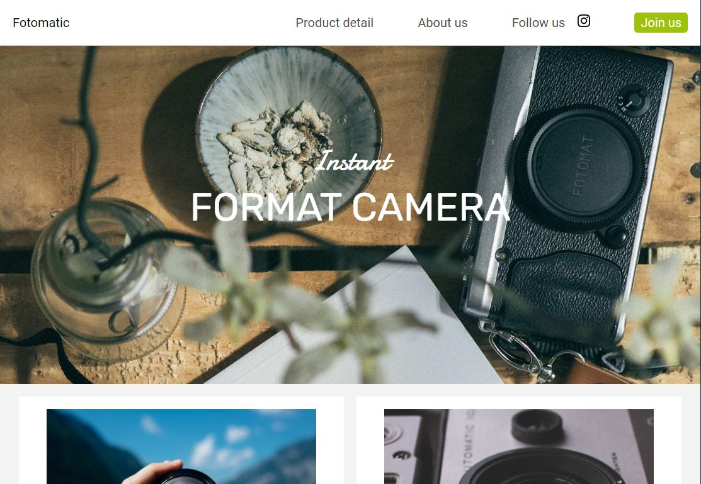

# Fotomatic
Sample website for Fotomatic, a fictional camera company, for practice designing a responsive website. The site layout adapts to desktop, tablet, and mobile screens. Created as part of the Full Stack Engineering Course at Codecademy.

## Table of Contents
* [Technologies Used](#technologies-used)
* [Screenshots](#screenshots)
* [Features](#features)
* [Setup](#setup)

## Technologies Used
   
- HTML5
- CSS3
- Git
- GitHub

## Screenshots

## Features
- Responsive web design
- Media queries

## Setup
- Available on [GitHub](https://github.com/RusselBrouts/Fotomatic)